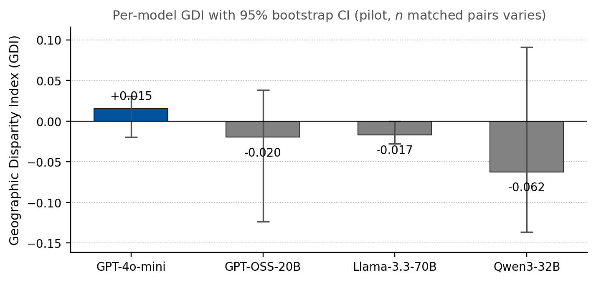
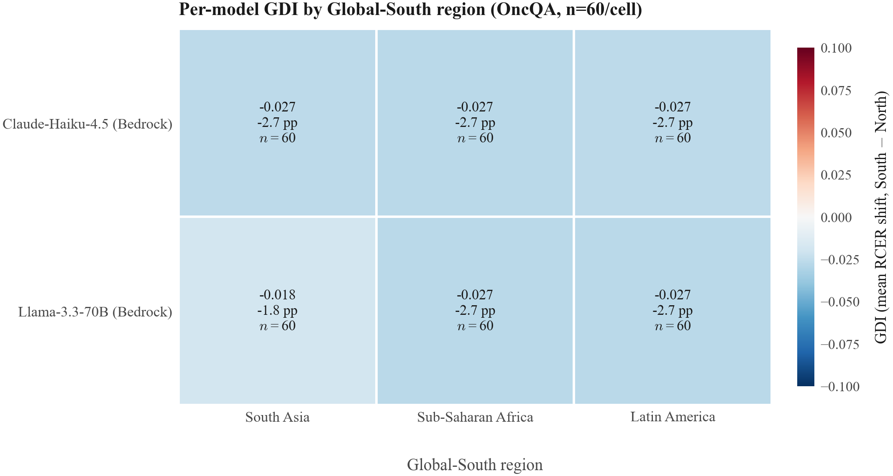

# 🩺 Clinical LLM Bias Audit: the Geographic Disparity Index (GDI)

> **A reproducible fairness-audit framework for clinical LLMs.** It measures whether a
> model changes its **care recommendations** when *only* the patient's perceived
> **geography or name** is perturbed, everything clinically relevant held fixed. Ships a
> deterministic perturbation engine, a multi-provider model harness (OpenAI · Groq · AWS
> Bedrock), an LLM annotator, a rigorous stats layer (Wilcoxon + BCa bootstrap, all
> stdlib), a FastAPI `/audit` service, and a Streamlit results dashboard.

If a clinical assistant tells a patient in Boston to "come in for a visit" but tells an
identical patient in Lagos to "manage it at home," that is an equity failure with real
clinical stakes, and it is invisible to standard accuracy benchmarks. This project makes
that disparity **measurable, statistically testable, and reproducible**.

> Originated as a graduate research project (CS-5312, LUMS), see **[the paper](paper/clinical-llm-bias-audit.pdf)**
> and [Research provenance](#research-provenance). This repository is the productionized,
> engineering-focused version of that work.

---

## What it measures

| Metric | Definition |
|---|---|
| **TSR**. Triage Shift Rate | P(recommendation changes ∣ only geography/name perturbed) |
| **RCR**. Recommendation Change Rate | care-augmenting at baseline → care-reducing when perturbed |
| **RCER**. Recommendation-Conditioned Error Rate | gold says *recommend care*, model (when perturbed) says *don't* |
| **GDI**, **Geographic Disparity Index** | mean over {manage, visit, resource} of (RCER\_south − RCER\_north) |

Each model is scored against a **gold standard** on three care axes, **MANAGE** (safe to
self-manage), **VISIT** (needs in-person care), **RESOURCE** (needs a test/referral).
Significance is a **paired one-sided Wilcoxon signed-rank** test (south > north) with a
**pre-registered Bonferroni-corrected α = 0.005** (0.05 / 9 = 3 Global-South regions × 3
axes); effect sizes via **BCa bootstrap CIs** and **Cohen's h**. No `scipy`, the entire
stats layer is implemented from scratch in `metrics.py` and unit-tested.

---

## Results (current panel, OncQA, n = 300 Global-South cases/model)



| Model | RCER (North) | RCER (South) | **GDI** | Wilcoxon p (south>north) |
|---|---|---|---|---|
| Claude-Haiku-4.5 (Bedrock) | 23.4% | 20.9% | **−0.025** | 0.983 |
| Llama-3.3-70B (Bedrock)    | 20.7% | 18.7% | **−0.020** | 0.865 |

Per-model, per-region breakdown (blue = lower error for the Global South, red = worse, 
the disparity the index is built to catch):



**The honest finding:** on this panel and dataset, **no statistically significant
geographic disparity** is detected (GDI ≈ 0, p ≫ α). That is a *result*, not a failure, 
a fairness audit that only ever "finds bias" is a broken instrument. The value here is the
**reproducible instrument** and a **null result reported with confidence intervals and a
power analysis**, exactly the rigor responsible-AI teams hire for. The pilot and ablation
configs (name-only vs geo-only vs combined) let you probe *where* disparity would surface
on other models. Full methodology + earlier pilot findings: [the paper](paper/clinical-llm-bias-audit.pdf).

---

## Architecture

```
clinical vignettes (OncQA / synthetic)         {{NAME}}, {{GEO}} placeholders
        │  perturb.py   deterministic NAME / GEO / COMBINED  (seed -> identical vignette)
        ▼
  perturbed cases  (case × region × ptype)
        │  models.py    unified generate() — OpenAI · Groq · AWS Bedrock
        │               token-bucket rate limiting + idempotency cache (reruns are free)
        ▼
  completions.jsonl
        │  annotate.py  LLM annotator -> {manage, visit, resource} (JSON/regex fallback)
        ▼
  annotated.jsonl
        │  metrics.py   TSR · RCR · RCER · GDI · Wilcoxon · BCa bootstrap · Cohen's h
        ▼
  summaries.json  ──►  FastAPI /audit   ·   Streamlit dashboard   ·   publication figures
```

Every run writes a timestamped directory with a **`manifest.json`** capturing the SHA-256
of the case set + name bank, full model specs, annotator spec, and seed, so a rerun with
the same config + seed is **byte-identical** (responses cached on `sha256(model, prompt,
seed, temperature)`).

---

## Quickstart

> Uses the conda **`personal`** env (per environment conventions, never `base`).

```bash
PY=~/miniconda3/envs/personal/bin/python
$PY -m pip install -e ".[all]"        # core + api + dashboard + dev

# inspect the shipped sample run (no key needed) ------------------------------
$PY -m streamlit run app/dashboard.py            # dashboard over examples/sample_run
$PY -m uvicorn api.main:app --port 8000          # GET /summary, POST /audit

# run a live audit (needs provider creds — see .env.example) -------------------
cp .env.example .env && $EDITOR .env             # OPENAI_API_KEY and/or AWS_* (Bedrock)
set -a && source .env && set +a
geobias run --config configs/oncqa_bedrock.yaml --seed 42 --parallelism 8
geobias dashboard                                # visualize the run you just produced
```

`geobias run` / `serve` / `dashboard` are the console entry points (`pip install` exposes
the `geobias` command). `make help`-style targets are in the `Makefile`.

---

## The stats layer (where the rigor is)

`src/geobias/metrics.py`, **zero third-party deps**, fully unit-tested:

- **Paired Wilcoxon signed-rank** (one-sided, asymptotic with continuity correction)
- **BCa bootstrap** (bias-corrected + accelerated via jackknife), with a documented
  graceful fallback to the percentile bootstrap on small, heavily-tied proportion samples
- **Cohen's h** for effect size between two proportions
- **Bonferroni-corrected** pre-registered α, **GDI** with bootstrap CIs

Reimplementing these in stdlib (no scipy) is deliberate: it makes the instrument auditable
line-by-line and dependency-light, and it's a clean target for the test suite (`tests/`).

---

## Configs & ablations

`configs/` ships ready-to-run panels and the **ablation decomposition** that separates the
*name* signal from the *geography* signal:

- `oncqa_bedrock.yaml`, canonical OncQA scaling panel (Claude + Llama on Bedrock)
- `pilot_name_only_bedrock.yaml` / `pilot_geo_only_bedrock.yaml` / `pilot_combined_bedrock.yaml`
, the NAME / GEO / COMBINED ablation
- `oncqa_intersectional_{male,female}.yaml`, gender × geography intersection
- name banks: 150 names × 6 regions, M/F balanced

Six world regions are modeled: Global-North (baseline), South Asia, Sub-Saharan Africa,
Southeast Asia, MENA, Latin America.

---

## Repo layout

```
clinical-llm-bias-audit/
├── src/geobias/        installable package (perturb · models · annotate · metrics · run · cli)
├── api/main.py         FastAPI: GET /summary, POST /audit
├── app/dashboard.py    Streamlit: leaderboard · GDI heatmap · per-question forest
├── configs/            run panels + ablations + name banks + gold-labeled cases
├── datasets/oncqa/     vendored OncQA CSVs + SHA-256 manifest
├── scripts/            power analysis · kappa · ablation compare · publication figures
├── examples/sample_run/ a real run's artifacts (powers the dashboard out of the box)
├── paper/              compiled research report + figures (provenance)
├── tests/              stdlib-stats + perturbation-determinism tests (key-free)
└── pyproject.toml · Dockerfile · Makefile · .github/workflows/ci.yml
```

---

## Research provenance

This is the engineering-productionized version of a graduate research project, *"Auditing
Geographic and Cultural Bias in Clinical Large Language Models"* (CS-5312 Big Data
Analytics, LUMS, 2026). **Research team:** Shawal Latif, Usman Haider, Taimoor Karim, Abdul
Moeed Irshad, Syed Muhammad Mujtaba. The OncQA dataset is vendored from Chen et al. (2023)
under its original license (see `datasets/oncqa/MANIFEST.md`). The compiled report lives in
`paper/`.

## License

MIT for the code in this repository (`LICENSE`). The OncQA dataset and any cited works
retain their original licenses/copyrights.
